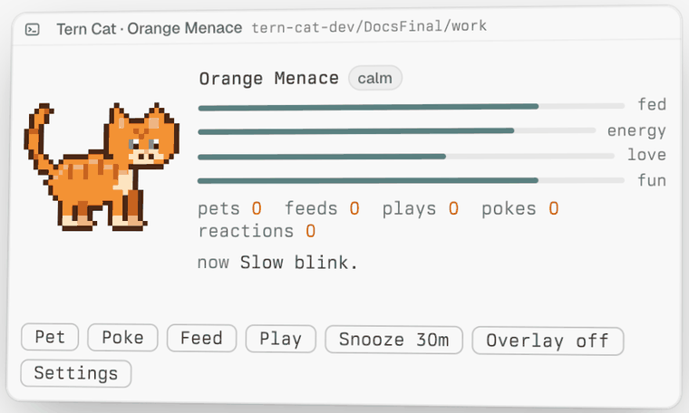
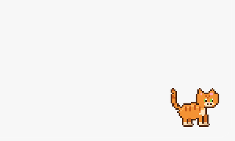
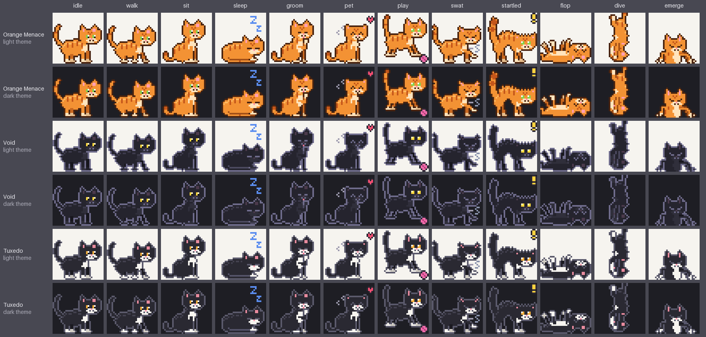

# tern-cat

An orange pixel cat that lives in your [Tern](https://docs.stencil.so/tern/) terminal: a block
you can pet, feed and play with, plus a small overlay copy in the corner of the focused pane. It
naps when you are away, reacts to commands finishing and remembers its stats.

| Floated card | Overlay cat |
|---|---|
|  |  |

## A word about orange cats

Orange cats are not pets. They are a single shared brain cell on a rotating schedule, wrapped in
fur and malice. Every orange cat in history has committed at least one act of domestic terrorism:
the 3 a.m. hallway sprint, the glass of water executed in cold blood while maintaining eye contact,
the hairball deployed precisely where your bare foot will land. They do not negotiate. They do
not repent. They knock your coffee off the desk, look at you, and knock the spoon off after it.

This one lives in your terminal now. It will sit on your work, judge your failed test runs,
stare at you when you type `sudo`, and swat at (a copy of) your `ls` output like it owes it money. You will
feed it anyway. That is how they win.

## Install

```sh
tern plugin install github.com/contrafy/tern-cat
```

Requires Tern 0.6.2 or later. Tested on macOS (Apple silicon); Linux runs in CI only.

## Usage

- The overlay cat is on by default in every window, in the focused pane's top-right corner (any
  corner via settings), and dives through a portal when you switch panes.
- **Open cat** in the palette opens the interactive block as a floating card.
- Click the sprite to pet, double-click to play, right-click for more.
- `ctrl+alt+cmd+c` hides or shows the overlay.
- Settings live in `<tern.plugin.data>/config.json` (or the block's settings page).

Controls, palette commands, behaviors, Carly exports and sound: [docs/usage.md](docs/usage.md).

## Appearance

Three bundled packs: `orange-menace` (default), `void`, `tuxedo`. Set `cat.appearance` in config.
Custom packs: [docs/sprite-pack-spec.md](docs/sprite-pack-spec.md).



## Privacy

- Never types into or reads a terminal, never touches the clipboard.
- No network requests; all state stays on your machine.
- Command lines are reduced to a category (test, build, ...) and discarded.

Details: [docs/security-privacy.md](docs/security-privacy.md).

## Status

- The overlay cat only looks and swats when you hover or press near it; clicks still go to the
  terminal, and it cannot be dragged or petted.
- No antics with real terminal text yet; the needed API is proposed in
  [docs/overlay-upstream-rfc.md](docs/overlay-upstream-rfc.md).
- Autonomous AI behavior is disabled.

## Docs

- [Usage](docs/usage.md)
- [Configuration](docs/configuration.md)
- [Architecture](docs/architecture.md)
- [Sprite pack spec](docs/sprite-pack-spec.md)
- [Development](docs/develop-with-omp-tern.md) and [CONTRIBUTING.md](CONTRIBUTING.md)
- [Performance](docs/performance.md)
- [SDK capability matrix](docs/sdk-capability-matrix.md)

## License

Code: [MIT](LICENSE). Bundled art and sound: CC-BY-4.0, credits in
[assets/CREDITS.md](assets/CREDITS.md).
