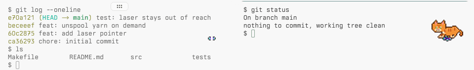
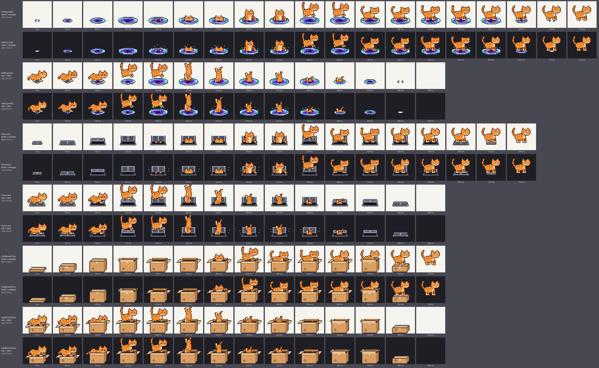

# tern-cat

[](https://github.com/contrafy/tern-cat/actions/workflows/ci.yml)
[](LICENSE)

A pixel cat that lives in your [Tern](https://docs.stencil.so/tern/) terminal: a block you can
pet, feed and play with, plus a small overlay copy in the corner of the focused pane that dives
through a portal when you switch panes. It naps when you are away, reacts to commands finishing
and remembers its stats. It never types into, reads or phones home from your terminal.


## A word about cats

Cats are not pets. They are a single shared brain cell on a rotating schedule, wrapped in fur and
malice. Every cat in history has committed at least one act of domestic terrorism: the 3 a.m.
hallway sprint, the glass of water executed in cold blood while maintaining eye contact, the
hairball deployed precisely where your bare foot will land. They do not negotiate. They do not
repent. They knock your coffee off the desk, look at you, and knock the spoon off after it.

This menace lives in your terminal now, in whatever coat you pick. It will sit on your work,
judge your failed test runs, stare at you when you type `sudo`, and swat at (a copy of) your `ls`
output like it owes it money. You will feed it anyway. That is how they win.

## Install

```sh
tern plugin install github.com/contrafy/tern-cat           # install
tern plugin install github.com/contrafy/tern-cat --force   # update
tern plugin remove tern-cat                                # uninstall
```

Requires Tern 0.6.2 or later. Removing the plugin keeps the cat's data folder (state, config,
user packs); [docs/usage.md](docs/usage.md#uninstall) says where it is if you want it gone too.

## Usage

- **Overlay.** On by default in every window, resting in the focused pane's top-right corner.
  `rendering.overlay_position` picks another corner and `rendering.overlay_offset_px` the gap.
  `ctrl+alt+cmd+c` hides or shows it.
- **Pointer reactions.** Move the pointer near or onto the overlay cat and it looks at you; press
  there and it swats. Visual only: the click still goes to the terminal and counts as nothing.
- **Pane switches.** When focus moves to another pane, tab or session, the cat dives into a prop
  in the pane it leaves and climbs out of one in the pane it enters. `rendering.pane_transition`:
  `portal` (default), `vent`, `box` or `off`.

  

- **Block.** **Open cat** in the palette floats the interactive block over the focused pane.
  Click the sprite to pet, double-click to play, right-click for food, toys and more; its
  settings page edits `<tern.plugin.data>/config.json` with a Reset on every row.

  

- **Behavior.** Presets `menace` (default), `quiet_office`, `chaos` and `zen`. Focus mode keeps
  the cat still while your commands run; snooze and quiet hours silence it.
- **Carly.** Carly can check on, pet, feed and configure the cat through validated exports, and
  gets a one-line summary of its mood in her context.

Controls, palette commands, behaviors, Carly exports and sound: [docs/usage.md](docs/usage.md).
Every setting: [docs/configuration.md](docs/configuration.md).

## Appearance

Three bundled packs: `orange-menace` (default), `void` and `tuxedo`; pick one on the block's
settings page or with `cat.appearance`. The default cat is named "Menace" (`cat.name`). Install
your own packs under `<tern.plugin.data>/packs/<id>/` and remove them again from the settings
page; the format is in [docs/sprite-pack-spec.md](docs/sprite-pack-spec.md).




## Privacy

- Never types into or reads a terminal, never touches the clipboard or Tern's settings.
- No network requests; all state stays on your machine under `<tern.plugin.data>`.
- Command lines are reduced to a category (test, build, ...) inside the hook and discarded.
- The overlay is CSS only: no pointer position or terminal content reaches the plugin.
- The only process it ever starts is the local sound player, and sound is off by default.

Tern has no permission system, so these are tern-cat's own guarantees, enforced by tests and
review: [docs/security-privacy.md](docs/security-privacy.md) explains each and how to audit it.

## Status

Public beta (0.x). Known limits:

- No antics with real terminal text: Tern has no API for cell geometry, so the `ls` swat is a
  parody inside the block. The missing API is proposed in
  [docs/overlay-upstream-rfc.md](docs/overlay-upstream-rfc.md).
- Overlay reactions are visual only and need the pointer over or near the cat; the overlay cat
  cannot be dragged or petted.
- Autonomous AI behavior is disabled: Tern 0.6.2 offers no constrained model route.
- Tested on macOS (Apple silicon) with Tern 0.6.2 only; Linux runs unit tests in CI.

## Docs

- [Usage](docs/usage.md) and [configuration](docs/configuration.md)
- [Security and privacy](docs/security-privacy.md)
- [Sprite and sound pack spec](docs/sprite-pack-spec.md)
- [Architecture](docs/architecture.md) and [performance](docs/performance.md)
- [Development](docs/develop-with-omp-tern.md) and [releasing](docs/release.md)
- [SDK capability matrix](docs/sdk-capability-matrix.md) and the
  [overlay API RFC](docs/overlay-upstream-rfc.md)
- [Changelog](CHANGELOG.md)

## Contributing

Bug reports, packs and pull requests are welcome: read [CONTRIBUTING.md](CONTRIBUTING.md) first.
Questions go where [SUPPORT.md](SUPPORT.md) says; vulnerabilities are reported privately as
described in [SECURITY.md](SECURITY.md). Everyone taking part follows the
[Code of Conduct](CODE_OF_CONDUCT.md).

## License

Code: [MIT](LICENSE). Bundled art and sound, by Ahmad Raaiyan: CC-BY-4.0, credits in
[assets/CREDITS.md](assets/CREDITS.md).
