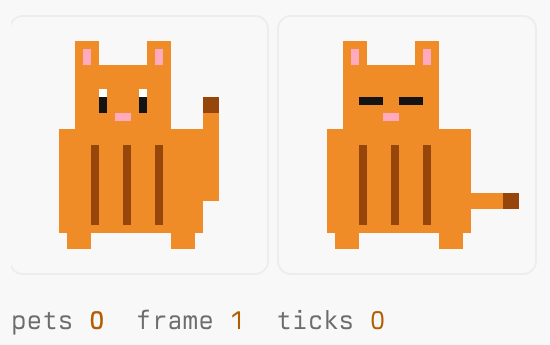
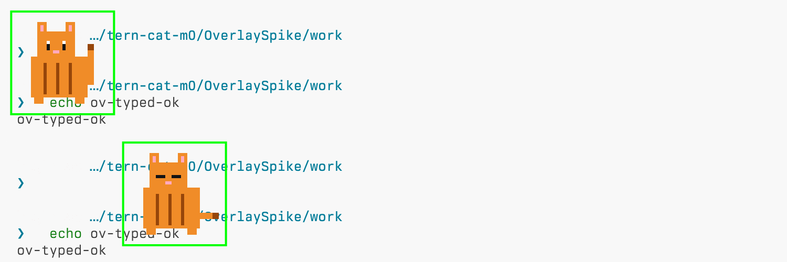

# SDK capability matrix (M0)

Target: Tern `0.6.2 (4b3ed42)` on macOS arm64. The API types came from `tern plugin types` (`tern.d.luau`, 1814 lines). Line references point into that file.

Tags:

- **VERIFIED**: observed in a sandboxed experiment, or quoted from the installed types or the docs URL named.
- **INFERENCE**: reasoning that has not been tested.

Docs root: https://docs.stencil.so/tern/

Experiments:

- **RenderSpike**: a block that renders a PNG/APNG sprite.
- **OverlaySpike**: a window-half CSS decoration plus a floated block.

Both ran against an isolated config, daemon and log directory (see [Dev isolation](#dev-isolation-recipe)).

## Summary

| # | Question | Answer | Tag |
|---|---|---|---|
| 1 | Do host hooks see terminal data? | Metadata only: command line, status, duration, cwd, title, pane exit | VERIFIED |
| 2 | Can a plugin draw an interactive image over arbitrary panes? | Decorative, non-interactive: yes, through window-half global CSS. Interactive: only inside a block, which can be floated into a pane corner | VERIFIED |
| 3 | Can a plugin read grid geometry and put a sprite on an `ls` glyph? | No. There is no cell geometry API. Text read-back exists, but it has no coordinates. See the upstream RFC | VERIFIED (absence) |
| 4 | Pointer, drag, focus/visibility, multi-window, frame callbacks? | Click, double-click and menu per node only. No hover, move, drag or frame callback. Window `focus` event and CSS-only visibility classes. Each window gets its own session | VERIFIED |
| 5 | Images, blobs, fps, hit-testing, sound? | PNG/APNG/GIF/WebP blobs (SHA-256 ids); ~10 fps is cheap; node-level click; no audio API | VERIFIED |
| 6 | One shared per-user cat model? | `tern.kv` (shared by both halves, all windows and all daemons on one config dir). No lock and no change notification, so use a single writer | VERIFIED |
| 7 | Consented autonomous Carly inference? | Exports and context work. There is no hidden completion API. A scheduled turn is a full-power Carly turn | VERIFIED |
| 8 | API version and CLI routes | No API version field. `plugin types/link/list/reload`, `tern shot`, `tern --control` | VERIFIED |

**Rendering decision:**

- The interactive cat is a **block**, opened on request. The preferred presentation is a **floated corner card** (`cx.layout:float`), with a normal split/tab block as the fallback.
- A **decorative overlay** cat is drawn with window-half `tern.css` and is on by default (hide/snooze via command, keybind or config). It is per-window, `pointer-events: none` and never interactive.
- Neither surface is a "global overlay renderer" in the compositor sense.



*Block render.* This is a headless `tern shot` with `remote loopback`. Left: the PNG frame swapped by Lua. Right: the APNG, pinned to frame 2 with `freeze-anims` + `motion-at 150`.



*Window-half CSS decoration.* The image pairs two shots taken about 1 s apart. The cat walked and changed frame over a live prompt. The green boxes are annotations added when the shots were composited. The hostname has been redacted.

## 1. Host hooks

| Item | Detail | Tag |
|---|---|---|
| Answer | Host hooks deliver shell metadata only | VERIFIED |
| Events, host half | `command_started`, `command_finished`, `cwd`, `title`, `pane_exited`, `spawn` (types L1767-1773) | VERIFIED |
| Events, window half | `window_start`, `focus`, `pane_created`, `pane_closed`, `tab_created`, `tab_closed`, `command_started`, `command_finished`, `cwd`, `title`, `canvas_action` | VERIFIED |
| Payload | `CommandFinishedEvent = { pane, line, status, took_ms }` (L1063-1072); no output text | VERIFIED |
| RenderSpike evidence | A host `command_finished` hook fired in the daemon, wrote `tern.kv` and re-rendered the live block | VERIFIED |
| Requirement | Command events need shell integration (OSC 133); see [guides/hooks](https://docs.stencil.so/tern/guides/hooks.html) | VERIFIED |
| Remote panes | A remote host runs its own host halves. The local host half never hears about remote panes, but the window half does | VERIFIED (docs) |
| Output text elsewhere | Window `cx.session:read(pane, opts)` returns up to 2000 lines, 64000 chars, scrollback on by default, with no coordinates. tern-cat never calls it on shell panes | VERIFIED |
| Budgets | Host 2 s per call; window 50 ms; formatters and `available` 4 ms. A tripped budget disables the hook until reload ([concepts/runtime](https://docs.stencil.so/tern/concepts/runtime.html)) | VERIFIED |
| Decision | Count command events in the host half only. Never read `line` into any outbound payload | - |

## 2. Drawing over panes

| Item | Detail | Tag |
|---|---|---|
| Overlay or decoration API | None in the types or the docs. A block's `layer` is drawn inside that block only | VERIFIED |
| Global CSS | `tern.css(name, src)` from the window half draws `position: fixed; z-index: 2147483647; pointer-events: none` pseudo-elements (`#panel::after`, `:root::after`, `body::after`, `#tabbar::after`) above panes, PiP cards and the tab bar | VERIFIED (OverlaySpike) |
| Images in CSS | Plugin-relative `url(sheet.png)` and `data:image/png;base64,…` both work. An APNG used as a CSS background shows only its first frame | VERIFIED |
| Animation | `@keyframes` translate plus `steps(N)` on `background-position` over a sprite sheet. `ctl stats` reports the element as animating | VERIFIED |
| Input pass-through | `ctl pick` under the cat hit `div.tv-rows`. With `pointer-events:auto` the same pick hit the pseudo box. A click under the cat focused `textarea.tv-input`. A selection dragged across the cat included the hidden characters. Typing and Enter ran the command | VERIFIED |
| Content unchanged | `cx.session:read(pane,{lines=60})` returned identical results with the overlay on and off | VERIFIED |
| Scope | A `tern.css` sheet exists only in the calling window's VM. Manifest `styles` apply in every window. The docs say both are machine-wide, but the experiment shows `tern.css` is per-window | VERIFIED (docs differ) |
| Reload | A sheet installed from a command handler is dropped on reload. A sheet installed at entry load survives. `tern.css(name, "")` leaves an empty sheet in place | VERIFIED |
| Follow focus with zero Lua | `section.tn-pane.on > .tn-body::after { position:absolute; right:12px; bottom:12px }` follows the focused pane across `split` and `focus` | VERIFIED |
| Interactivity | Not possible: pass-through requires `pointer-events:none`, and the window half has no DOM or class API | VERIFIED |
| Floated block (PiP) | `cx:new_block(kind, args, "beside")` then `cx.layout:float(pane, owner, "br")` gives a 465x278 CSS px card (59x14 cells) over the owner. The owner keeps 160x45 cells and keeps keyboard focus. A single click does not steal focus | VERIFIED |
| Float limits | The plugin can set only the corner. `layout:resize` on a float returns `false`; only the user can resize it. `how="pip"` raises. The host `resize` hook did not fire for a float, and `cx.cols`/`rows` stayed at 80x24 | VERIFIED |

### Decision and rationale

**Interactive cat:** a block, opened on request and floated into a pane corner by default.

- It is the only surface that receives clicks. Click to visible took about 16-29 ms, including ctl overhead (RenderSpike).
- It does not take the owner pane's focus or reflow its content.

**Decoration (on by default):** window-half `tern.css`.

- It is per-window.
- It is non-interactive and passes input through.
- Terminal content is unchanged.

**CPU of the decoration** (OverlaySpike, window process, % of one core):

| Motion | CPU % | fps |
|---|---|---|
| Static | 0.0 | 0 |
| Smooth `linear` walk | 12.9 | 80 |
| `steps(100)` over 10 s (10 Hz) | 2.0 | 10 |
| Lua re-installs a `pos` sheet every 100 ms | 5.8 | - |
| `transition … steps(30)` waypoints | ~1.4 (lower bound) | - |
| `reduce_motion=on` | 0.17 | 0 |

**Design rule:** quantize every motion with `steps()`. Never use smooth transitions; they render at display rate.

**Reduced motion:**

- Tern's `motion.css` zeroes animation and transition durations under `prefers-reduced-motion`.
- Tern's `reduce_motion` setting drives that media query in plugin sheets.

VERIFIED.

## 3. Grid geometry and the `ls` glyph gag

| Item | Detail | Tag |
|---|---|---|
| Cell, glyph, cursor or font metrics | None. A grep of the types for `overlay`, `grid`, `geometry`, `pixel`, `sprite`, `hit.?test`, `pointer` and `mouse` finds no geometry API. `TabLayout` gives split ratios only | VERIFIED |
| Text read-back | `cx.session:read` returns line strings with no screen row or column. Screen position could only be guessed | VERIFIED / INFERENCE (guess) |
| CSS reaching glyphs | No selector targets terminal cells. INFERENCE: the grid is drawn as rows, not per-glyph elements | INFERENCE |
| Decision | The `ls` gag is a parody inside the cat's own block. Upstream proposal: [overlay-upstream-rfc.md](overlay-upstream-rfc.md) | - |

## 4. Pointer, focus, visibility, windows, frame callbacks

| Item | Detail | Tag |
|---|---|---|
| Pointer | Per-node `actions = {click, dblclick, menu}`, giving `{ev="action", id, act, value?, mods?}`. Docs: "Hover, scrolling, text selection, tooltips and the context menu are Tern's own." No move, hover, drag or wheel events ([protocol/input](https://docs.stencil.so/tern/protocol/input.html)) | VERIFIED |
| Keyboard | `key(state, key, cx)` only while the block has focus. `tern.bind` and command `keys` are window-wide. Chords already bound are dropped with a warning | VERIFIED |
| Window focus | The window `focus({pane, tab})` event covers pane/tab focus, not OS window focus | VERIFIED |
| Visibility | CSS-only region classes: `.sf-paused` (surface not visible), `.sf-still` (reduced motion), `.sf-unfocused`. `cx.session:view(pane)` returns nil when hidden. No occlusion, minimize or battery signal | VERIFIED |
| Hidden cost | A Lua-timer block keeps sending frames while hidden: window 0.84 % plus daemon 0.9 %. An APNG costs about 0 when hidden. The cat must throttle itself | VERIFIED |
| Frame callbacks | None; the only option is `tern.timer`. A 100 ms timer measured 9.6 swaps/s | VERIFIED |
| Multi-window | Each window process gets its own session on the shared daemon. `window_start` fires per window, and each window's block is a separate pane. A reopened window adopts an orphaned session | VERIFIED |
| Window identity | No window id exists. `TERN_WINDOW_KEY` is nil in a clean env. Discriminators: the current session id from `cx.session:sessions()`, or a random id generated at load (it changes on every reload) | VERIFIED |
| Reload | `window_start` does not fire again on reload. Window halves lose all Lua state, so per-window state must be rebuilt at entry load | VERIFIED |
| Mirroring one session in two clients | Documented ([concepts/architecture](https://docs.stencil.so/tern/concepts/architecture.html)), not reproduced (no web client assets) | BLOCKED |

**Multi-window verdict:** windows use separate sessions. Each window opens its own cat block from `window_start`. All of them read one shared profile from `tern.kv`.

## 5. Images, blobs, frame rate, hit-testing, sound

| Item | Detail | Tag |
|---|---|---|
| Image node | `tern.ui.node("image", {blob = cx:blob(bytes, "image/png"), w, h})`. There is no `ui.image` builder. `image-rendering: pixelated` comes from manifest CSS | VERIFIED |
| Formats | PNG, JPEG, GIF and WebP up to 4096 px per side; SVG up to 256 KiB. An animation over 1024 frames or 64 MiB of decoded pixels shows only its first frame ([elements/data](https://docs.stencil.so/tern/elements/data.html#image)) | VERIFIED (docs) |
| Blob ids | The id is the SHA-256 of the bytes, so re-sending the same bytes is idempotent | VERIFIED (docs) |
| APNG | Plays on the window animation clock. `freeze-anims` + `motion-at` pins it deterministically | VERIFIED |
| Late-attach hazard | When a frame swaps one node's `blob`, a window that attaches later shows the "missing" placeholder. Fix: keep every frame node in the view and toggle a `role` hidden by CSS | VERIFIED |
| Cost | One 10 fps animated sprite in a visible window costs about 3-3.5 % (subtraction estimate). Paused and hidden costs about 0.2 % | VERIFIED (measured) / INFERENCE (per-sprite split) |
| Hit-testing | Per node only; a node `click` action replaces the image's built-in zoom | VERIFIED |
| Limits | Messages over 64 KiB are chunked. At most 8 `cx` render rounds per handler. VM 256 MiB ([reference/limits](https://docs.stencil.so/tern/reference/limits.html)) | VERIFIED (docs) |

**Sound verdict:** Tern has no audio API.

- The types contain no `audio`, `sound`, `play` or `beep` (VERIFIED).
- `cx:toast` is silent.
- Companion approach: run `tern.process.run({"afplay", "-v", volume, path}, {timeout_ms}, cb)` on macOS, or `pw-play`/`paplay`/`aplay` on Linux. `tern.process.run` is available to both halves; tern-cat runs it only from the host half (`host.luau` → `cat/integrations/sound.luau`), so sound plays once per user rather than once per window.
- OverlaySpike confirmed the call from the window half returns in about 1 ms with the callback after about 1.45 s (played at volume 0). A missing binary raises synchronously (VERIFIED).
- Sound is muted by default; this is self-imposed, because Tern has no permission prompt.

## 6. Shared per-user cat model

| Item | Detail | Tag |
|---|---|---|
| `tern.kv` | JSON values in `<config>/plugin-data/<id>/kv.json`. Shared by both halves, every window, and every daemon using the same config dir (loopback, standalone and `tern shot` daemons all saw the same data). Each VM re-reads the file when its mtime or length changes | VERIFIED |
| Concurrency | `set` writes the whole file atomically (temp file plus rename). "Two VMs setting at the same moment still race: the later rename wins." No lock, CAS or change notification | VERIFIED (docs) |
| `tern.fs` | Unrestricted paths. Writes are not atomic. No rename, stat or watch | VERIFIED (docs) |
| Block `save` | Stored with the pane in `<TERN_DAEMON_SOCKET>.state`. It survives a daemon restart and is per pane, not per user | VERIFIED |
| Host half | One VM per plugin per daemon (one daemon per user). In-memory state dies on reload | VERIFIED (docs) |
| Window to host channel | `cx.session:event(blockPane, {ev="action", …})` fires the host block `event` in the same millisecond | VERIFIED |
| Host to window channel | Host `cx:open("scheme://…")` reaches the window's `tern.route.link`. Window to host to window took about 1.5 ms | VERIFIED |

**Storage verdict:**

- **Single writer:** the host half is the only writer of the profile in `tern.kv`, with a monotonically increasing `rev`.
- **Window intents:** windows send intents through block events, or through an `fs` inbox under `tern.plugin.data` that the host drains.
- **Readers:** windows read the profile by polling `kv.get`, which is cheap when the file has not changed.

## 7. Carly

| Item | Detail | Tag |
|---|---|---|
| Availability | Window half only, desktop only (L1541; [guides/carly](https://docs.stencil.so/tern/guides/carly.html)) | VERIFIED (docs/types) |
| `tern.carly.export` | Names match `[a-z][a-z0-9_]{0,23}`, at most 16. `sig` and `doc` are each 1-1024 bytes. Values cross as JSON. The callback runs under the 50 ms budget; `call:wait(ms)` allows up to 120000 ms. No per-call approval, so validate every argument | VERIFIED (docs/types) |
| Reply cap | **Discrepancy:** guides/carly and api-window say **16 KiB**; `ExportCall.reply` in the types says **1 MiB** (longer strings are cut). Design for 16 KiB or less | VERIFIED (both texts) |
| `tern.carly.context` | One provider per plugin. 4 ms budget. 400 chars per plugin and 1600 total | VERIFIED (docs/types) |
| `cx:ask_carly(text)` | Opens Carly with a visible question and returns nothing | VERIFIED (docs/types) |
| `tern.carly.schedule` | Recorded as `by="plugin:<id>"`. Triggers are time or window events with a `check`. Recurring model turns are at least 5 min apart. Event watches expire in 12 h by default (7 d max). At most 50 tasks. User-revocable in Settings, Carly, Scheduled | VERIFIED (docs/types) |
| Turn power | A scheduled turn is a full Carly turn: "There is no separate Carly approval or per-turn access tier." Lua, `run_command` and `send_input` are all available, so plugin prompt wording cannot enforce safety | VERIFIED (docs) |
| Hidden completion | None documented. Possible routes, all untested: polling `TaskRun.text`; `cx.agents` (a visible agent pane); a user-configured provider through `tern.fetch` | VERIFIED (absence) / INFERENCE (workarounds) |

**Carly verdict:**

- Exports and the short context string ship.
- Autonomous AI ships as a **disabled-by-default adapter** behind explicit consent, with a mock provider for tests.
- It is never marketed as constrained, because a scheduled turn is full-power Carly.

**Testing:**

- Real exports need a real window: `tern --control`, then `carly lua "return await(plugins['tern-cat'].status())"`, `carly context`, `carly task event …`, `carly task run <id> "<text>"` ([scripts/carly](https://docs.stencil.so/tern/scripts/carly.html)).
- Headless windows never start omp and load no window halves.
- These commands come from the docs and have not been executed. INFERENCE.

## 8. API version and CLI routes

| Item | Detail | Tag |
|---|---|---|
| Version | `tern --version` gives `tern 0.6.2 (4b3ed42)`. "The plugin API has no version number". Detect features with `if tern.x then` ([guides/distribution](https://docs.stencil.so/tern/guides/distribution.html)) | VERIFIED |
| Manifest | `plugin.toml`, `schema = 1`, id `^[a-z][a-z0-9-]{0,31}$`. Unknown keys are errors. No permissions field ([reference/manifest](https://docs.stencil.so/tern/reference/manifest.html)) | VERIFIED |
| Types | `tern plugin types <dir>` writes `tern.d.luau` | VERIFIED |
| Install/reload | `tern plugin link <dir>`; `tern plugin list [--json]` (validates the manifest only when no daemon is running); `tern plugin reload` (exit 1 on problems). Saving a file reloads in under 1.5 s. Block `save` state survives reload | VERIFIED |
| Opening a block | Palette "New <title> block" (works headless) or window `cx:new_block`. `tern new` has no block argument | VERIFIED / INFERENCE (`tern new`) |
| Permissions | "Tern does not declare, check or prompt for capabilities" ([concepts/security](https://docs.stencil.so/tern/concepts/security.html)). All safety rules are self-imposed | VERIFIED (docs) |
| Examples | https://github.com/stencil-hq/tern-sdk/tree/main/plugins/examples/ | VERIFIED (docs link) |

## Headless testing recipe

| Need | Route | Tag |
|---|---|---|
| Golden shot of the block (host half) | A scenario containing `remote loopback <name>` starts an in-process daemon that loads `$TERN_CONFIG_DIR/plugins`. Then `palette "New … block"`, `key Enter`, `freeze-anims`, `motion-at <ms>`, `shot <name>`. Run it with `tern shot scenario.txt --theme both` (about 0.9 s) | VERIFIED |
| Without loopback | `tern shot`/`tern serve` load no user plugins | VERIFIED |
| Window half (`window_start`, `tern.css`, Carly exports) | Needs a real window: `tern --control <sock> <dir>`, then `tern ctl --control <sock> …` (`plugins run`, `shot`, `pick`, `click`, `css`, `stats`, `perf`) | VERIFIED |
| Determinism | `freeze-anims`/`motion-at` pin APNG and CSS animation, but not Lua timers, which run on the daemon's real clock. The plugin needs an injectable clock or a pause | VERIFIED |
| Shell hazard | Headless panes run the user's real login shell and dotfiles. Avoid scenario `run`, or pin `SHELL`/`HOME` | VERIFIED |
| Window shot path | `ctl shot` against a real window writes relative to the window's cwd | VERIFIED |

## Dev isolation recipe

```sh
export SB=/tmp/tern-cat-dev/<name>
export TERN_CONFIG_DIR=$SB/cfg
export TERN_DAEMON_SOCKET=$SB/daemon.sock
export STENCIL_LOG_DIR=$SB/logs
export STENCIL_LOG=warn,stencil=info,tern::plugin=debug
# A shell running inside Tern inherits pane vars that point at the real daemon.
unset TERN_PANE TERN_PANE_SOCKET TERN_WINDOW_KEY TERN_WINDOW_SOCKET TERN_BLOB_DIR TERN_COMPLETE TERN_LENSES TERN_IDENTITY
```

| Check | Result | Tag |
|---|---|---|
| `tern plugin dir --json` | Points at `$SB/cfg/plugins` | VERIFIED |
| A window started with `TERN_DAEMON_SOCKET` | Spawns its own daemon on that socket | VERIFIED |
| Without the `unset` line | The window half read the parent Tern's `TERN_PANE_SOCKET` and `TERN_PANE` through `tern.getenv` | VERIFIED |
| Idle daemon | A bare `tern daemon` with no clients stops after about 10 s | VERIFIED |
| Account | The sign-in is not isolated by `TERN_CONFIG_DIR` (keychain, INFERENCE). Nothing is written to it | VERIFIED / INFERENCE |
